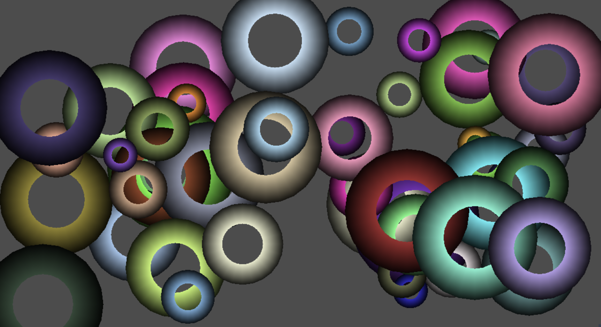
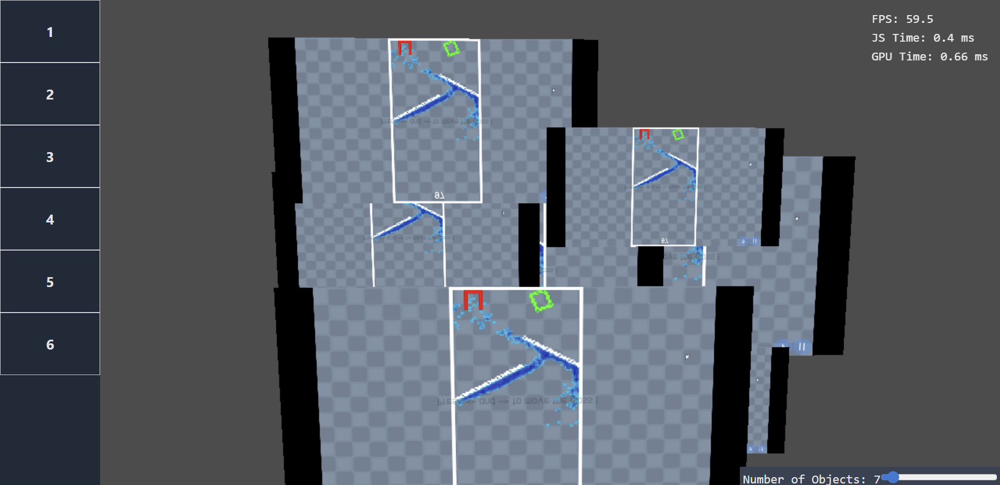

# Recollection of basic WebGPU samples / tutorials and basic features

This is a repository hosted [HERE](https://skyepulse.github.io/projects/webGPU-Basics-Collections/) where you can check out very basic examples using the webGPU API and the code / shaders that come with them.

Really cool if you want to start learning and check some examples of what can be done and how.

## Screenshots

