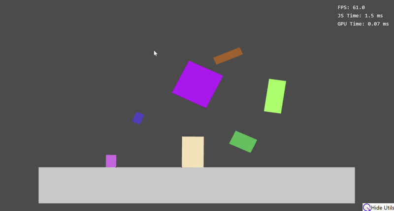
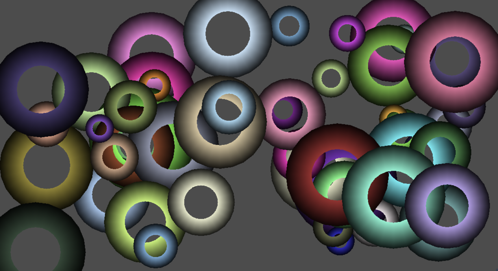
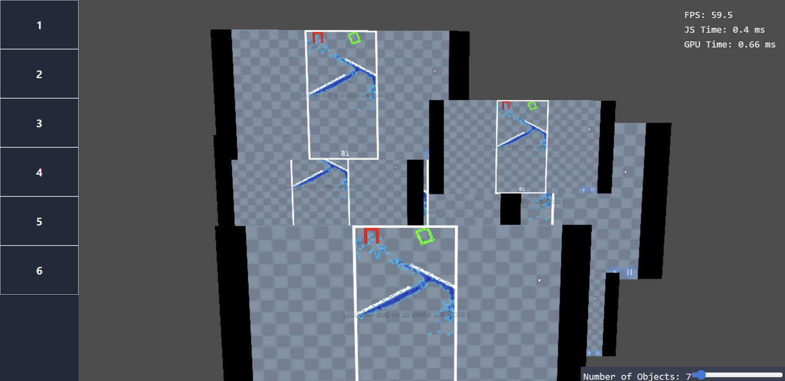

# Recollection of basic WebGPU samples / tutorials and basic features to more advanced rendering techniques

This is a repository hosted [HERE](https://skyepulse.github.io/projects/webGPU-Basics-Collections/) where you can check out very basic examples using the webGPU API and the code / shaders that come with them.

<table>
	<tr>
		<td></td>
		<td></td>
	</tr>
	<tr>
		<td></td>
		<td></td>
	</tr>
</table>

Really cool if you want to start learning and check some examples of what can be done and how.

I also added some more advanced rendering techniques, like ray tracing, Physics based rendering, BVH construction, accelerated ray tracing and Monte Carlo Path Tracing algorithms.

## Screenshots

